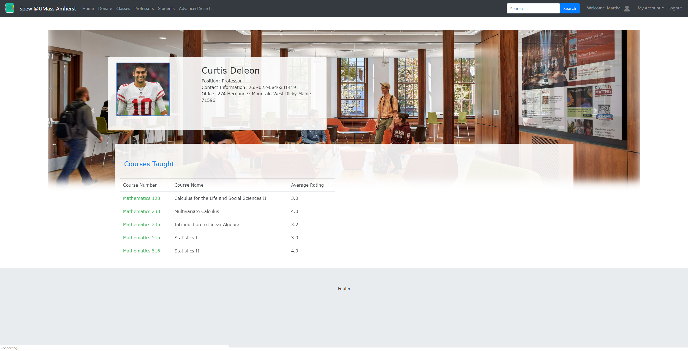
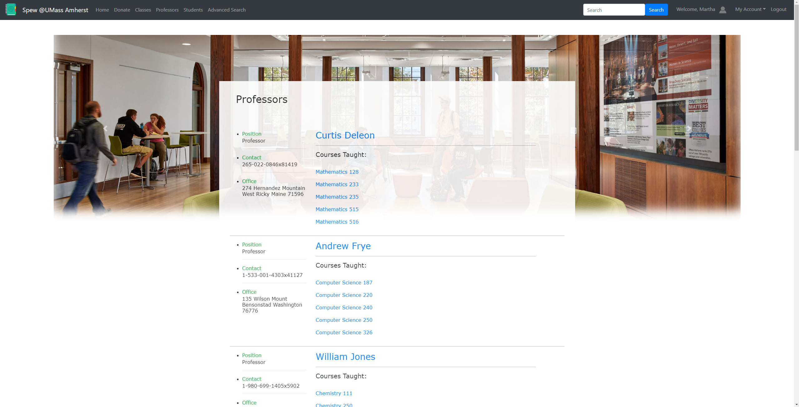
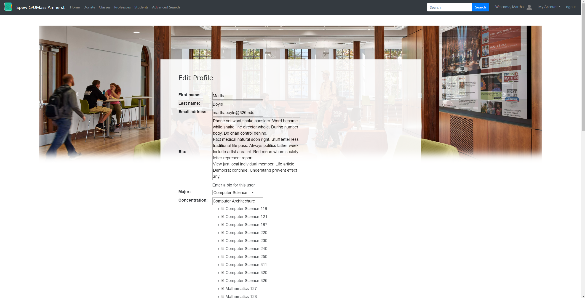
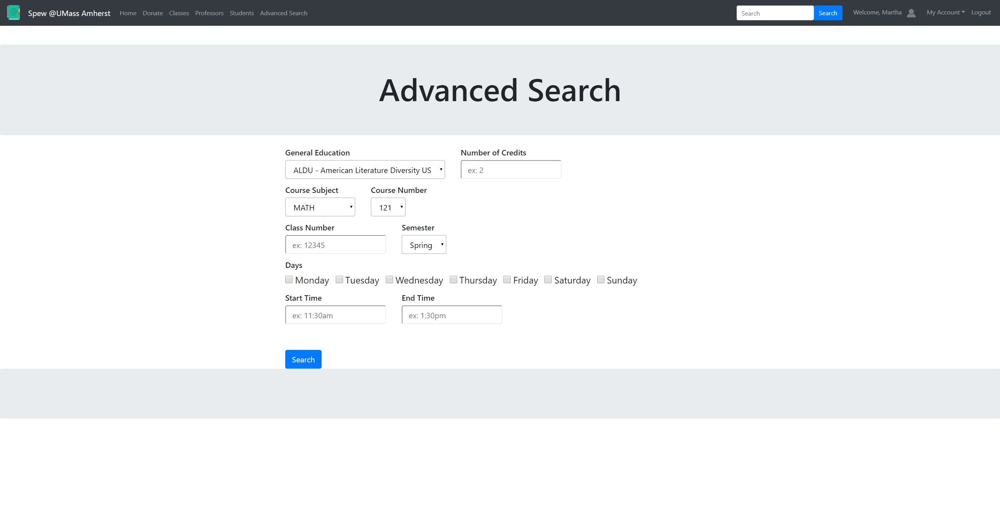

Title: Weebs

Subtitle: Spew

Semester: Fall 2018

Overview: A brief overview of your application. This will be based on what you are submitting as your final web application artifact. You should also mention why your application is innovative.

Team Members: Lucas Phan, Thanh Pham, Nhi Lam, Richard Li, Taesan Yoon, Michael Ahn

User Interface: Each page of our UI is fairly self-explanatory. We have a persistent nav bar at the top that has links to each of the views.

Home Page / Landing Page

Registration Page

Login Page

Class Page - Contains all of the fine details of each class

Class List Page - Lists all of the available classes

Professor Page - Contains all of the fine details of each professor

Professor List Page - Lists all of the professors

Student Page - Contains all of the fine details of each student

Student List Page - Lists all of the students

Edit Profile Page - Only accessible for your own user page

Search Page - Currently not functional, but self-explanatory

Search Results Page - Currently not functional, but self-explanatory

Data Model: A final up-to-date diagram of your data model including a brief description of each of the entities in your model and their relationships.

URL Routes/Mappings: 

| Route               | Purpose                                                                                                        | 
|---------------------|:--------------------------------------------------------------------------------------------------------------:|
| users/              | Viewing the list of users on the website                                                                       |
| classes/            | Viewing the list of classes on the website                                                                     |
| professors/         | Viewing the list of professors on the website                                                                  |
| class/<int:pk>/     | Viewing the details of a class                                                                                 |
| user/<str:pk>/      | Viewing the details of a user                                                                                  |
| professor/<int:pk>  | Viewing the details of a professor                                                                             |
| search_results      | Viewing a list of classes based on a user’s certain criteria                                                   |
| advanced_search     | Allows user to find classes based on multiple forms of criteria                                                |
| accounts/register/  | A page allowing a person to register as a user of the website                                                  |
| accounts/login/     | A page that allows a person to log in. This route requires authentication of the user logging in.              |
| submissions/create/ | Allows user to submit feedback for a class. Student only has permissions to create feedbacks for themselvelves,| 
| edit_profile/       | Allows user to edit their profile settings. A student only has permissions to edit their own profile.          |                                   |
Authentication/Authorization: We have authentication for students only. Registration creates a User along with a Student (profile) which is a one-to-one model in relation to the User in order to add additional fields, basically extending the User model. The students, only once logged in, will be able to review classes (leave feedback and ratings). Users will only be able to access the edit profile for their own user profile page, not anyone else's. The user is also able to edit their password by going through the password reset form on the registration page. Only admins will be able to add classes and professors.

Team Choice: You should briefly mention your team choice component for your application. You should highlight any additions to your application that are part of your team choice, such as, URL routes, UI views, data model, to make it clear what your team choice addition is.

Conclusion: This semester there were many things we as a team were able to learn  a website using django framework. On team level, we learned the importance of having clear and concise communication. When we were able to accomplish this feat, this made our work and progress much faster. We also learned the importance of always looking forward when making decisions and how our current design could affect things we would want to implement later. For instance, we tried to implement a custom user, but this caused issues later when we could not utilize django’s built in authentication with the custom user. In hindsight, it would have been better to use the default django user. All in all, the lessons that we learned will help us further our careers in computer science.
Throughout our project timeline we face many difficulties. One of the major difficulties that we faced was making group time when everyone was available. Every member in the group had a fairly busy schedule. So we were very fortunate when we could all find time to meet. Another, difficulty that we had was managing the github repo. It was very challenging at first to avoiding merge conflicts or making sure that we were adding helpful commits to our additions. 
We believe that if we took a crash course on how Github worked before starting this project, we could’ve avoided a lot of “who worked on what?” questions, as well as improved general folder organization. It was to our detriment that everyone in our group assumed that other people knew how Github worked. Knowing each others’ schedules and sharing them earlier on would also have improved our project experience, as scheduling conflicts were a frequent re-occurrence throughout the semester. Some technical issues we encountered were: computing average rating for a class and creating a custom spew user. We realized that in order to display the average rating for a class, we needed to consider the multiple feedback objects that went into the computation. For the custom spew user, we tried to go this route because of admin page errors. However, this conflicted with the django authentication that is given to the default user class.

